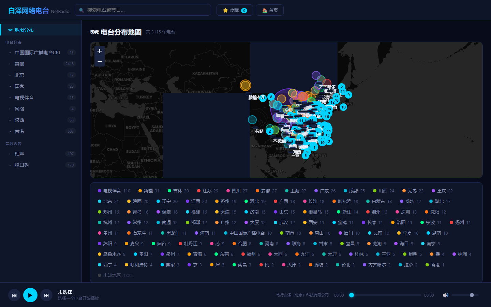

# 白泽网络电台

基于电台名称解析地理分布的 Web 网络电台播放器。

## 界面



## 功能

- **地图分布** — 自动解析电台名称中的城市/省份信息，在地图上可视化分布
- **电台播放** — 支持 HLS (m3u8) 和 MP3 流媒体播放
- **分类浏览** — 按省份和音频内容（相声/脱口秀）分类浏览
- **搜索** — 实时搜索过滤，关键词高亮
- **收藏** — 服务端存储收藏列表，多设备同步
- **地理解析** — 内置 100+ 中国城市/省份地理坐标库

## 快速开始

```bash
# 安装依赖
pip install fastapi uvicorn xlrd

# 启动服务
python server.py

# 访问 http://localhost:8000
```

## 技术栈

| 层 | 技术 |
|---|---|
| 后端 | Python + FastAPI + uvicorn |
| 前端 | 纯 HTML/CSS/JS 单页应用 |
| 地图 | Leaflet.js + CartoDB 暗色瓦片 |
| 播放 | hls.js (HLS) + HTML5 Audio (MP3) |
| 数据 | xlrd (解析 Excel) |
| 存储 | SQLite (收藏) |

## 数据源

`radio-list.xls` 包含 3115 个网络电台、197 个相声节目和 170 个脱口秀节目。

## 部署

参考 `deploy/` 目录下的 Nginx 反向代理和 systemd 服务配置。

## 许可

笃行白泽（北京）科技有限公司
